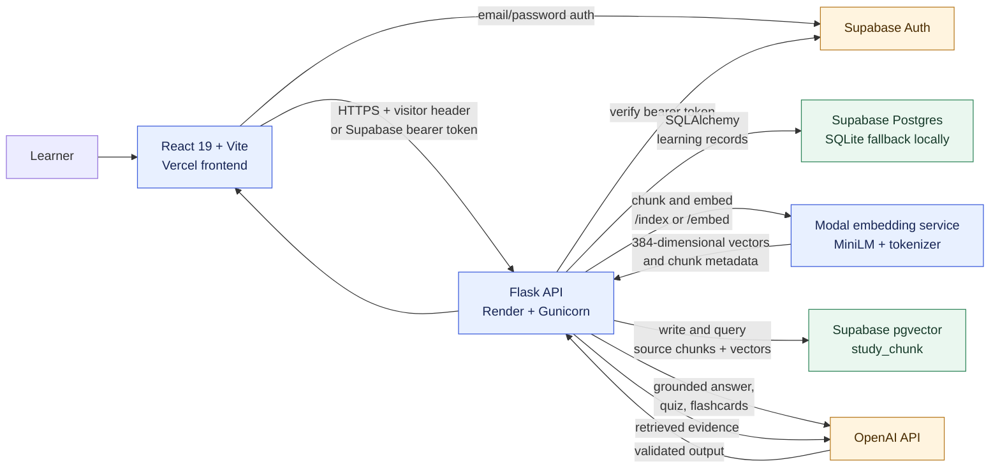
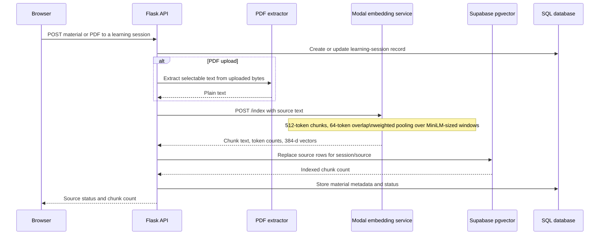
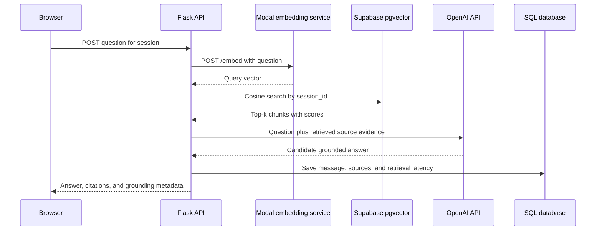
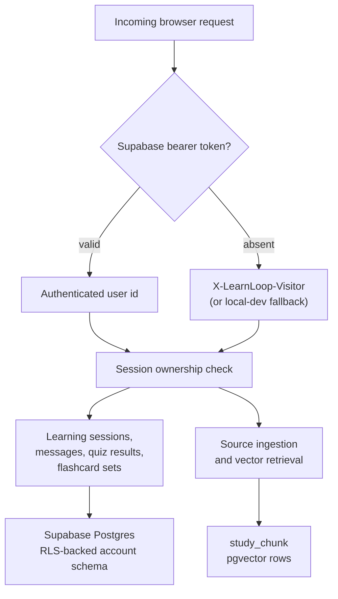

# LearnLoop Architecture

This document describes the implemented LearnLoop architecture as of 2026-08-03. It is intentionally split into system boundaries and request flows so that the research claims in the repository can be traced to code and configuration.

## System context

The API is the trust boundary. The browser never receives database credentials or the Modal token. Authenticated requests are checked against Supabase Auth. Guest requests use an `X-LearnLoop-Visitor` browser-session identifier.

## Source ingestion flow

Pasted text is stored through the legacy `StudyMaterial` SQLAlchemy path. PDF text is held in the current in-memory source registry while its chunks are persisted in pgvector. This is a known privacy and deployment boundary, not a claim that all source text is ephemeral.

## Grounded question flow

The same session retrieval path supplies context for quiz and flashcard generation. Pydantic schemas validate generated structures, and the bounded repair loop returns a stable error after the allowed retries are exhausted.

## Identity and persistence

Account-associated activity is stored in the Supabase schema. Guest activity is scoped by the browser visitor identifier. The current migration comment states that `study_chunk` access is enforced by the Flask API; database-level RLS for this legacy Flask table remains a hardening task.

## Repository map

| Concern | Code or configuration |
| --- | --- |
| Flask app factory and startup | `backend/app/factory.py`, `backend/main.py`, `backend/wsgi.py` |
| Auth and ownership | `backend/app/auth.py`, `backend/app/study_routes.py` |
| Study and generation routes | `backend/app/routes.py`, `backend/app/study_routes.py` |
| PDF extraction and source registry | `backend/app/services/pdf.py`, `backend/app/services/pdf_sources.py` |
| Embedding boundary and retrieval orchestration | `backend/app/services/embeddings.py`, `backend/app/services/rag.py` |
| Vector persistence | `backend/app/services/vector_store.py`, `supabase/migrations/20260803180000_create_study_chunks_vector.sql` |
| Modal model service | `modal/embedding_service.py` |
| Client API and UI | `frontend/src/api/learnloopApi.js`, `frontend/src/pages/`, `frontend/src/components/` |
| Evidence and verification | `docs/benchmarks/`, `docs/load-tests/`, `scripts/verify.sh` |

## Boundaries and non-claims

- The checked-in retrieval benchmarks are historical local MiniLM and FAISS evidence. They do not verify current Modal or pgvector performance.
- The 500-user Locust result is a shared-machine local result, not hosted capacity evidence.
- Modal deployment, the production pgvector migration, and public end-to-end verification remain operational work recorded in [`STATUS.md`](STATUS.md).
- Source retention is not uniform yet. The portfolio should describe the current durable pgvector and legacy SQLAlchemy paths, not claim session-only storage globally.
